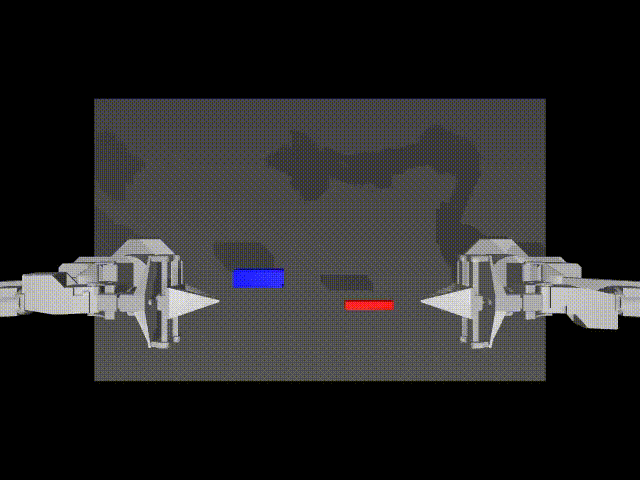
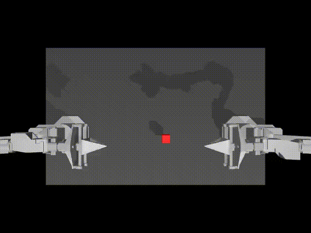
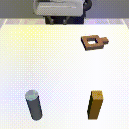

# IL-Studio: A Plug-and-Play Imitation-Learning Playground for Robotics

| ACT - Insertion                              | Diffusion UNet - Transfer Cube                   | ACT - Square                                      |
|----------------------------------------------|--------------------------------------------------|---------------------------------------------------|
|  |  |  |

IL-Studio is an open-source repository that lets researchers and engineers jump-start imitation-learning experiments on popular robot manipulation benchmarks with minimal friction. The entire training, evaluation, and deployment pipeline has been carefully modularized so that you can swap-in your own policy, environment, or dataset without touching the rest of the stack.

# Installation
```shell
pip install -r requirements.txt
```

# TODO
- rewrite evaluation pipeline
- add octo
- add roboflamingo
- add CALVIN benchmark
- add Installation Description
- add deploy module 
- ...

# Usage
```shell
# model_name must be in vla and task_name must be in configuration.constants.TASK_CONFIGS
python train.py --model_name act --task_name example_tasks --output_dir output_dir_path 
```

# Overview
We show the architecture as below:


# Model
important APIs from each `vla.algo_name.__init__`
- `def load_model(args: transformers.HfArgumentParser) -> dict(model=transformers.PreTrainedModel, ...)` # loading models
- (OPTIONAL) `def get_data_processor(dataset: torch.utils.data.Dataset, args: transformers.HfArgumentParser, model_components: dict) -> function` # sample-level data processing
- (OPTIONAL) `def get_data_collator(args: transformers.HfArgumentParser, model_components:dict) -> function` # batch-level data processing
- (OPTIONAL) `class Trainer(transformers.trainer.Trainer)`

The model returned by `load_model` should implement:
- `def select_action(self, obs) -> action`

## Currently available algorithms:
- ACT
- Diffusion Policy
- Qwen2VL+DP
- OpenVLA
- Pi0

# Dataset
Each dataset refers to a dictionary containing 
```shell
--dataset_dir
    ├─ episode_00.hdf5
    ├─ episode_01.hdf5
    ├─...
```

The architecture of each .hdf5 file should be like
```shell
# T is the length of the episode
# we denote the gripper state by the openning degree of the gripper (e.g., x m),
# and we denote the gripper action by 0=close and 1=open, which is the same as openvla 
# the minimal setting of the data configuration is labeled by * (e.g., 'ee' can be replaced by 'joint' and 'primary' can be replaced by 'wrist')

Dataset: dataset_dir (Shape: (1,), Dtype: object)           # the dataset directionary of the episode, str
Dataset: episode_id (Shape: (1,), Dtype: object)            # the id of the episode, str
Dataset: freq (Shape: (1,), Dtype: float32)                 # control frequency
Dataset: language_instruction (Shape: (1,), Dtype: object)  #*task instruction, str 
Dataset: robot (Shape: (1,), Dtype: object)                 # robot name, str
Dataset: action_ee (Shape: (T, 7), Dtype: float32)          #*action of end-effector and gripper, e.g., [ee_xyz(3), ee_yrp(3), gripper_action(1)] 
Dataset: action_joint (Shape: (T, 8), Dtype: float32)       # action of joints and gripper, e.g., [joints(7), gripper_state(1)]
Group: observations
  Group: image
    Dataset: primary (Shape: (T, H, W, 3), Dtype: uint8)    #*primary camera
    Dataset: wrist (Shape: (T, H, W, 3), Dtype: uint8)      # wrist camera
    Dataset: ...
  Group: depth                                              # the depth
    Dataset: primary (Shape: (T, H, W), Dtype: float32)     # primary camera depth
    Dataset: wrist (Shape: (T, H, W), Dtype: float32)       # wrist camera 
    Dataset: ...
  Dataset: state_ee (Shape: (T, 7), Dtype: float32)         #*state of end-effector and gripper, e.g., [ee_xyz(3), ee_yrp(3), gripper_action(1)] 
  Dataset: state_joint (Shape: (T, 8), Dtype: float32)      # state of joints and gripper, e.g., [joints(7), gripper_state(1)]
Group: reasoning                                            # reasoning information 
```

The dataset's item should be a dict like 
```python
{
    'image': torch.Tensor((K, C, H, W), dtype=torch.uint8), # K is the number of images (i.e., primary, wrist, ) and C is the number of channels 
    'action': torch.Tensor((chunk_size, action_dim), dtype=torch.float32),
    'state': torch.Tensor((chunk_size, state_dim), dtype=torch.float32),
    'raw_lang': str,
    'is_pad': torch.Tensor((chunk_size, action_dim), dtype=torch.bool),
    'reasoning': str,
}
```

To add customized datasets, please modify
```python
TASK_CONFIGS = {
    ...,
    'task_name':{
        'dataset_dir': [
            dataset_dir, # the path of the dataset
        ],
        'episode_len': int,
        'camera_names': List(str), # e.g., ['primary']
    },
}
```

## Data Preparation

| Name   | Download | Remark|
|----------|-----------|-------------|
| Aloha   | [link](https://drive.google.com/drive/folders/1gPR03v05S1xiInoVJn7G7VJ9pDCnxq9O)  |   |
| VLA-OS | [link](https://huggingface.co/datasets/Linslab/VLA-OS-Dataset)  |   |
| Open-X | [link](https://github.com/google-deepmind/open_x_embodiment)  |    |


# TroubleShooting

- aloha env raises error 'mujoco.FatalError: an OpenGL platform library has not been loaded into this process, this most likely means that a valid OpenGL context has not been created before mjr_makeContext was called'. 

if the platform is headless, please use the command below to solve this issue:
```shell
export MUJOCO_GL=egl
```
